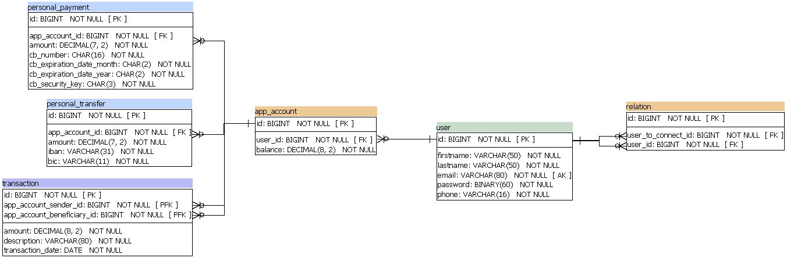
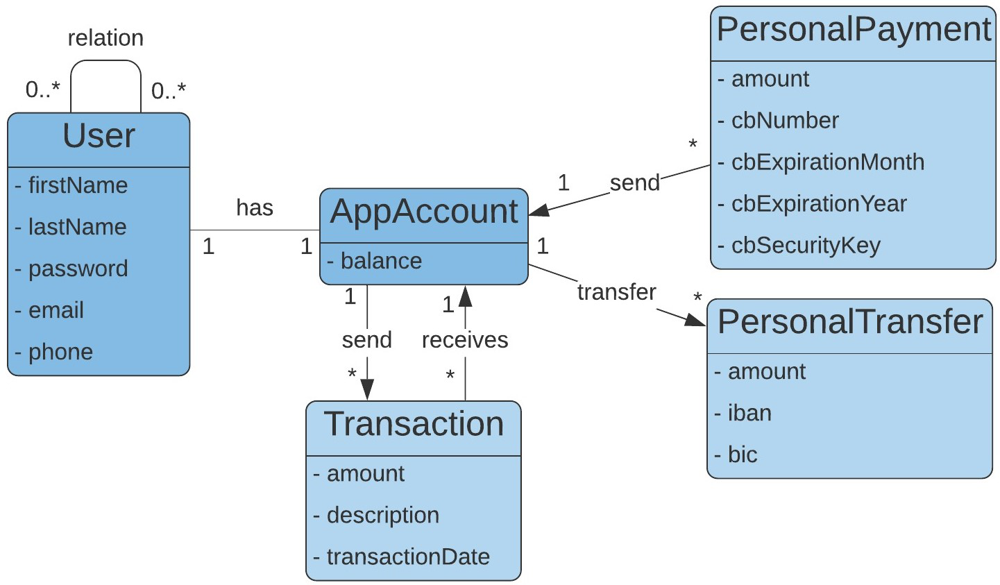
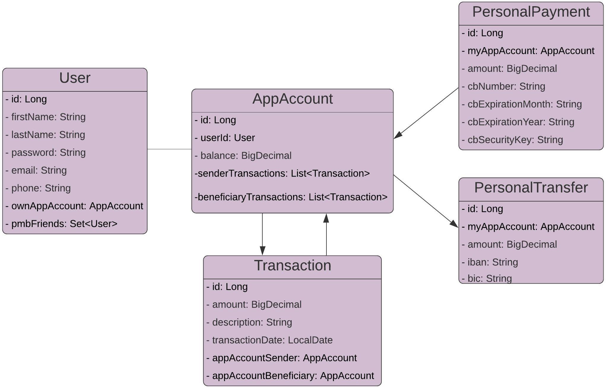

# Pay My Buddy

- The java application "Pay My Buddy" is an app used to send money to friends, for all countries which use the Euro as currency.

- This app is run with Spring Boot and Maven.

- Only model, service and repository application layers are available for this version 1.0 .

## Features

The user can:

<ol>
	<li>Create an account and update his account informations (phone or password)</li> 	
	<li>Add friends with email (if exists in database) or delete the relation</li> 
	<li>Send money to friend's app account</li> 
	<li>Make personal payments: from bank account to app account, via bank card</li>
	<li>Personal transfer: from app account to bank account, via Iban</li> 		
	<li>Generate user's invoicing, between two dates</li> 
</ol>

## Infos - Configuration

- **Author:** Ludovic Tuccio

- **Java** 11, **MySql** 8.0, **Spring Boot** 2.3.2, **Spring Data Jpa**, **Hibernate** 5

## Database

- The application used a database named "pmb_database", and "pmb_database_test" for the tests.

- The file **schema.sql** (available in *"/src/main/resources"*) contains scrypt SQL to create "dev" database.

- The file **dropAndCreate.sql** (available in *"/src/test/resources"*) contains scrypt SQL to create "test" database, and **dbTest.sql** contains data for tests.

## Security

- Database password and username encryption with Jasypt. 

- The user passwords are encrypted with BCryptPasswordEncoder (Spring Security).

## Installing

1.Install Java:

https://www.oracle.com/java/technologies/javase-jdk11-downloads.html

2.Install Maven:

https://maven.apache.org/install.html

3.Install MySql:

https://dev.mysql.com/downloads/installer/

## Testing

Launch **mvn site** for checkstyle, findbugs, surefire and jacoco reports (available in *"target/site"*).

## MPD

## Business model

## Java model

